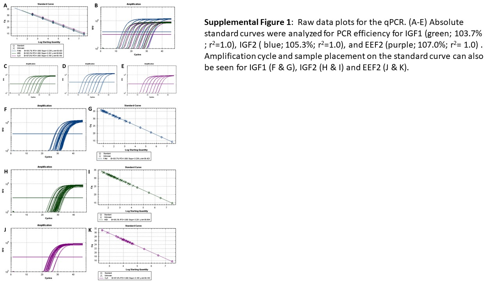
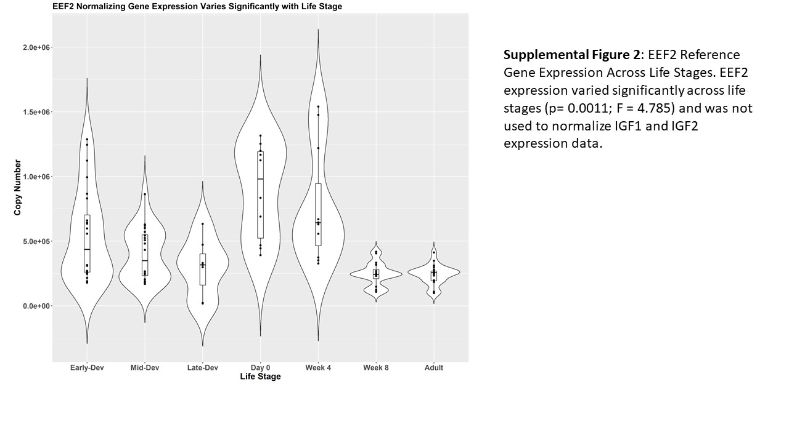
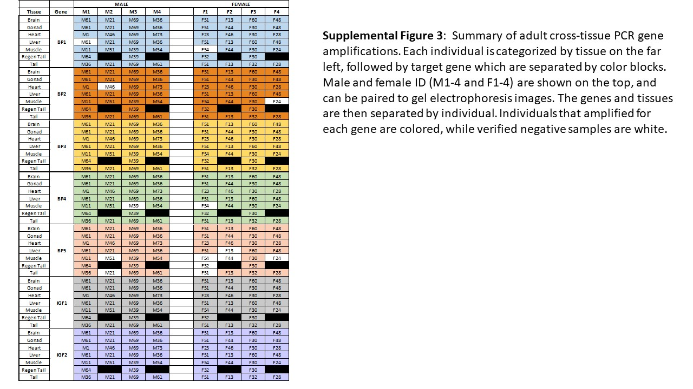

# IGF-Network-Expression-in-the-Brown-Anole
This repository holds all supplemental files for "Gene expression of the IGF hormones and IGF binding proteins across time and tissues in a model reptile".

## Publication Abstract: 
"The Insulin and Insulin-like Signaling (IIS) network regulates cellular processes including pre- and post-natal growth, cellular development, wound healing, reproduction, and longevity.  Despite their importance on the physiology of vertebrates, the study of the specific functions of the top regulators of the IIS network — insulin-like growth factors (IGF) and IGF binding proteins (IGFBPs) has been mostly limited to a few model organisms. To expand our understanding of this network, we performed quantitative gene expression of IGF hormones, and qualitative expression of IGFBPs across developmental stage and tissues in a model reptile, the brown anole lizard (Anolis sagrei). We find that contradictory to the patterns seen in lab rodents, but similar to humans as well as some fish, avian, and amphibian species, lizards expresses IGF2 across all life stages (pre-oviposition to adulthood), and at a higher level than IGF1. IGFBP expression was ubiquitous across tissues (brain, gonad, heart, liver, skeletal muscle, tail and regenerating tail) in the adult, apart from IGFBP5 which is variable. When compared to the known expression patterns in mice and humans, the anole qualitatively mimics the patterns observed in humans with nearly all IIS members represented here. The data collected in this study is an essential foundation for further developing the anole as a physiological and biomedical model, as well as expanding our understanding the function of the IIS network across species."

### Supplemental Figures

### Quick Key to File Directory: Detailed Descriptions of file use can be found below.
File Type | &nbsp;
------------------------------------ | -----------------------------------------------------
Protocols and Interactive Worksheets | [Molecular Protocol](Brown.Anole.qPCR.Protocol.pdf) 
&nbsp;                               | [Appendix A: Primer Design](Appendix_A.Primer_Design.txt)
&nbsp;                               | [Appendix B: Standard Preparation](Appendix_B.Standard.Prep.Worksheet.xlsx)
&nbsp;                               | [Appendix C: qPCR Calculations](Appendix_C.qPCR.Calculations.xlsx)
Raw Data                             | [Plate 1](qPCR_Plate_10_24.zip)
&nbsp;                               | [Plate 2](qPCR_Plate_2.zip)
Final Data                           | [IGFs and EEF2 Final](combined.data.final.csv)
&nbsp;                               | [IGF1 Undiluted](undiluted.samples.csv)
&nbsp;                               | [Presence Absence Heatmap](heatmap.data2.csv)
Statistical Code                     | [Code](AJP.Publication.Code_transformed_rtr.Rmd)
&nbsp;                               | [Code output](AJP.Publication.Code_transformed_rtr.html)
Sample Classification                | [Gel images](Presence.Absence.Gel.Images.pptx)
Sequencing Verification              | [Gene Amplifications](Primer.Sequencing.Results.zip)

### Molecular Protocols 
The protocol for molecular processes used in this experiment, RNA extraction through qPCR analysis, can be found [here](Brown.Anole.qPCR.Protocol.pdf). 

Within the molecular protocol, a series of appendices are referenced. [Appendix A](Appendix_A.Primer_Design.txt) contains the gene sequences for IGF1, IGF2, and EEF2 that were used for primer and probe design. [Appendix B](Appendix_B.Standard.Prep.Worksheet.xlsx) contains the excels spreadsheet used to prepare the absolute standard curve. If downloaded, this sheet is easily amendable for use. [Appendix C](Appendix_C.qPCR.Calculations.xlsx) contains an amendable spreadsheet for qPCR mastermix preparation and plate setup. 

### Sequence Verification of Primers
Each primer pair amplification for IGF1, IGF2, the IGFBPs, and EEF2 was verified by sequencing. The [sequencing files](Primer.Sequencing.Results.zip) contain the raw seqences, Geneious sequencing alignments to references, and alignment images. 

### qPCR Amplification Data Output 
Raw data output files for two plates of qPCR amplification ([Plate 1](qPCR_Plate_10_24.zip) and [Plate 2](qPCR_Plate_2.zip)) were exported from the Bio-Rad CFX Maestro qPCR Analysis Program. Triplicates were examined for consistancy, and any triplicate more than 0.25 cycles from the mean were excluded from the analysis. If more than one sample from a triplication was outside of the cutoff, the sample was dropped from analysis. The [final data set](combined.data.final.csv) contains only samples used in statistical analysis.
The [file](undiluted.samples.csv) containing undiluted amplifications of IGF1 was used in order to verify negative IGF1 results seen at a cDNA concentration of 1:100. 

### Statistical Analysis 
The statistical analyses were performed in R (version 3.5.1) using [code](AJP.Publication.Code.Rmd) in an R Markdown format. [Code output](AJP.Publication.Code.html) displays all statistical models, results, and figures produced. Note, you will have to download the HTML file to visualize the data output. 

### Presence-Absence Visualization
Following conventional PCR, gel electrophoresis was used to visualize samples as being present, or absent. [Gel images](Presence.Absence.Gel.Images.pptx) were used to classify samples. The file used to create the expression [heatmap](heatmap.data2.csv) contains the average percentage of indivdiuals that expressed each gene (IGF1, IGF2, and IGFBPs) across tissues. 
